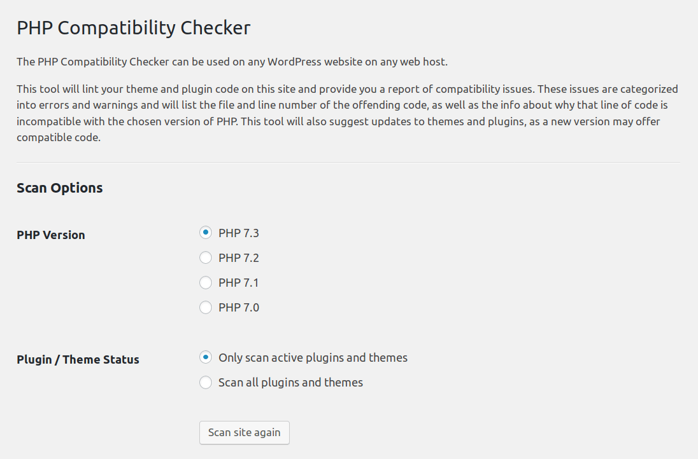
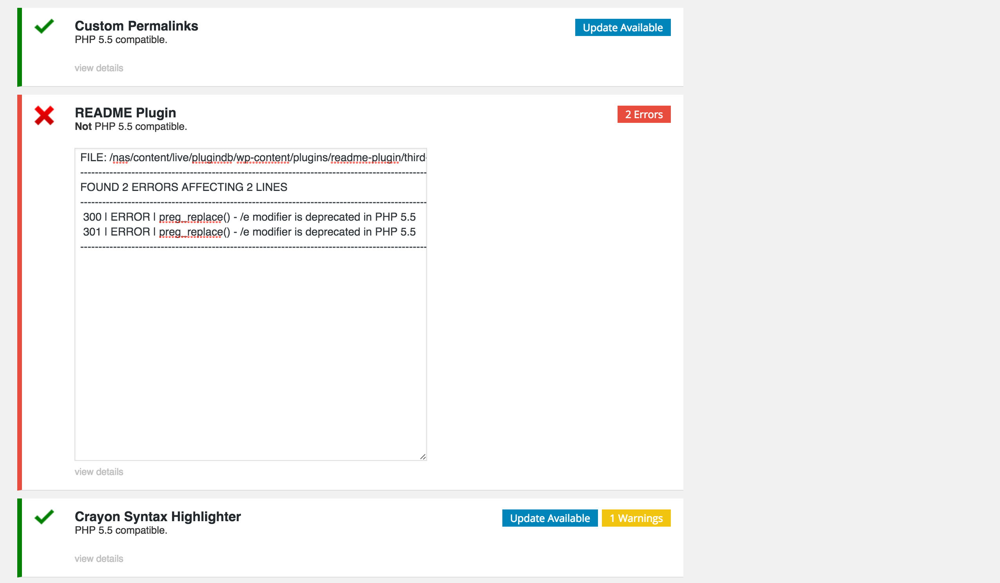

# PHP Compatibility Checker #
**Contributors:** [wpengine](https://profiles.wordpress.org/wpengine), [octalmage](https://profiles.wordpress.org/octalmage), [stevenkword](https://profiles.wordpress.org/stevenkword), [taylor4484](https://profiles.wordpress.org/taylor4484)  
**Tags:** php 7, php 5.5, php, version, compatibility, checker, wp engine, wpe, wpengine  
**Requires at least:** 3.0.1  
**Tested up to:** 4.5  
**Stable tag:** 1.0.2  
**License:** GPLv2 or later  
**License URI:** http://www.gnu.org/licenses/gpl-2.0.html  

Make sure your plugins and themes are compatible with newer PHP versions. 

## Description ##

The WP Engine PHP Compatibility Checker can be used by any WordPress website on any web host to check PHP version compatibility. 

This plugin will lint theme and plugin code inside your WordPress file system and give you back a report of compatibility issues for you to fix. Compatibility issues are categorized into errors and warnings and will list the file and line number of the offending code, as well as the info about why that line of code is incompatible with the chosen version of PHP. The plugin will also suggest updates to themes and plugins, as a new version may offer compatible code.

**This plugin does not execute your theme and plugin code, as such this plugin cannot detect runtime compatibility issues.**

**Please note that linting code is not perfect. We are aware of a few infrequent false positives, we are continuously working to ensure the checker provides the most accurate results possible.**

### Update to PHP 7 ###
* Use this plugin to check your site for compatibility for PHP 7! 
* As of July 2016, 59.3% of WordPress websites run a PHP version less PHP 5.5.
* These versions of PHP have been deprecated and unsupported for over 9 months.
* Only 1.8% of WordPress websites run PHP 7, the current main version of PHP. 

### Disclaimer ###
*While this plugin is written to detect as many problems as accurately as possible, 100% reliable detection is very difficult to ensure. It is best practice to run comprehensive tests before you migrate to a new PHP version.*

The plugin was created by WP Engine to help the WordPress community increase adoption of modern PHP versions. We [welcome contributors](https://github.com/wpengine/phpcompat) to this plugin, and are excited to see how developers and other WordPress hosts use this plugin.

To disclose security issues for this plugin please email WordPress@wpengine.com 

## Installation ##

*Note: If you have WordPress 2.7 or above you can simply go to 'Plugins' > 'Add New' in the WordPress admin and search for "PHP Compatibility Checker" and install it from there.*

To manually install: 
1. Upload `phpcompat` to the `/wpengine-wp-content/plugins/` directory
2. Activate the plugin through the 'Plugins' menu in WordPress

You will find the plugin options in the WP Admin `Tools => PHP Compatibility` menu. Once you click `run` it will take a few minutes to conduct the test. While the test is running, you cannot navigate away from the page. 

There are WP-CLI commands available see the [Other Notes](https://wordpress.org/plugins/php-compatibility-checker/other_notes/) tab for details.

## Other Notes ##

PHP Compatibility Checker includes WP-CLI command support:

`wp phpcompat <version> [--scan=<scan>]`

`  
<version>
    PHP version to test.

[--scan=<scan>]
  Whether to scan only active plugins and themes or all of them.
  default: active
  options:
    - active
    - all
`
Example: `wp phpcompat 5.5 --scan=active`

## Frequently Asked Questions ##

1. Will this work outside of the WP Engine hosting account?

Yes, this plugin can be used any ANY WordPress website on ANY host. 

2. Are there WP-CLI commands available?
Yes, this plugin does extend WP-CLI and provide commands. See the [Other Notes](https://wordpress.org/plugins/php-compatibility-checker/other_notes/) tab for details.

3. Can I use this to test non-WordPress PHP Projects? 
  
Yes! While you cannot use this WordPress plugin to test your non-WordPress projects, you can use the [Open Source PHPCompatibility Library](https://github.com/wimg/PHPCompatibility) that this plugin is built on.

4. Why was my plugin/theme skipped?
Some servers have timeouts to prevent long running queries, this is commonly 60 seconds. This can prevent the checker from being able to process large themes or plugins. You should check with your host to see if this timeout can be temporarily removed. The best way around this timeout issues is to run this plugin on a [local copy](https://make.wordpress.org/core/handbook/tutorials/installing-a-local-server/) of your site. 

5. I found a bug, or have a suggestion, can I contribute back? 

Yes! WP Engine has a public GitHub repo where you can contribute back to this plugin. Please open an issue on the [Plugin GitHub](https://github.com/wpengine/phpcompat). We actively develop this plugin, and are always happy to receive pull requests. 

The plugin was created by WP Engine to help the WordPress community increase adoption of modern PHP versions. We welcome contributors to this plugin, and are excited to see how developers and other WordPress hosts use this plugin.

To disclose security issues for this plugin please email WordPress@wpengine.com 

## Screenshots ##

### 1. Main screen: compatibility checker options ###

### 2. Compatibility results screen ###

## Changelog ##

### 1.0.2 ###
- Added additional role protections
- Changed the UI colors to better understand output at a glance
- Exclude checking node_modules and tmp directories 
- Added support for child theme's parent theme

### 1.0.1 ###
- Updated compatibility library with a few bugfixes
- Added skip logic to prevent checker from hanging

### 1.0.0 ###
- Major update to add PHP 7 checking support
- Improved the UX of the progress bar
- Fixed bug with the way the plugin menu was registered

### 0.1.0 ###
- Initial version
- PHP 5.5, 5.4, and 5.3 Support
- Basic WP-CLI Commands

## Upgrade Notice ##

### 1.0.2 ###
- Added additional role protections
- Changed the UI colors to better understand output at a glance
- Exclude checking node_modules and tmp directories 
- Added support for child theme's parent theme
